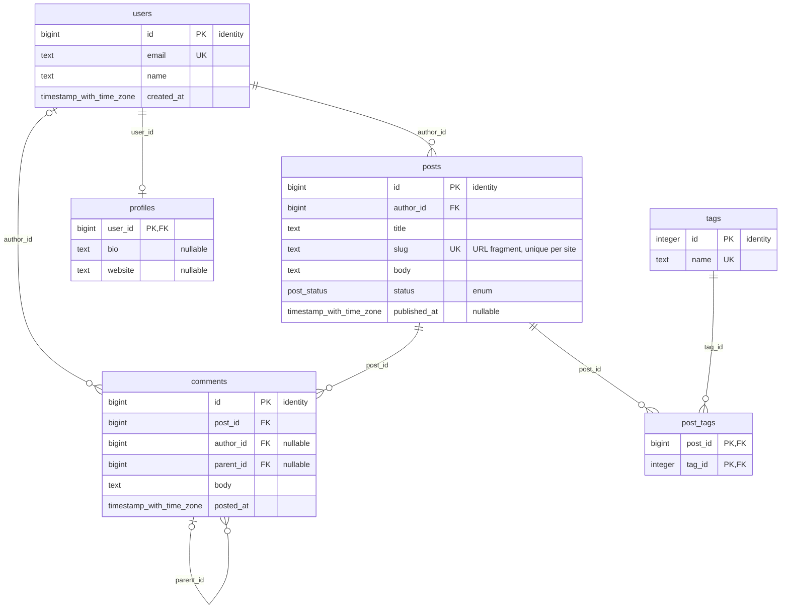
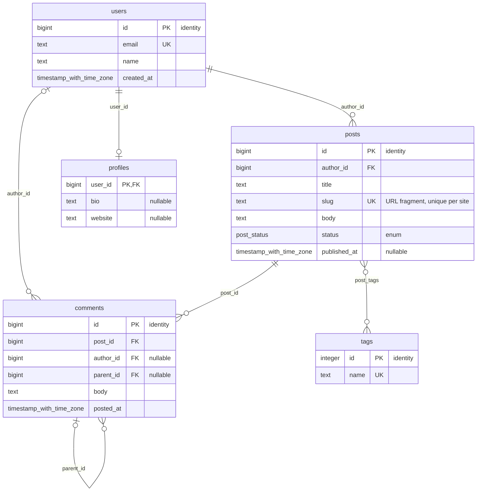
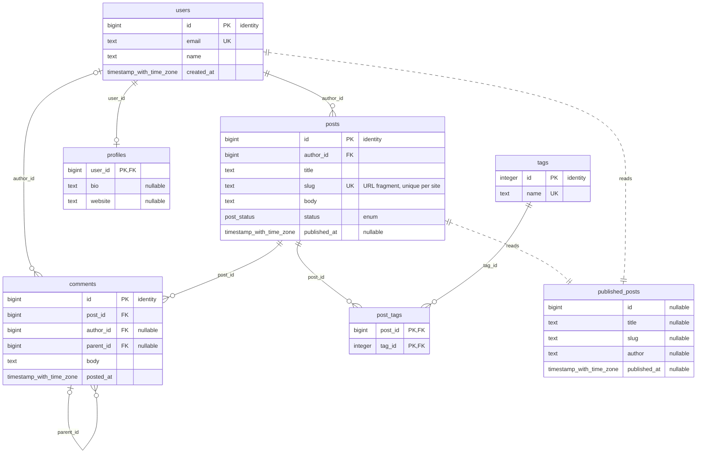
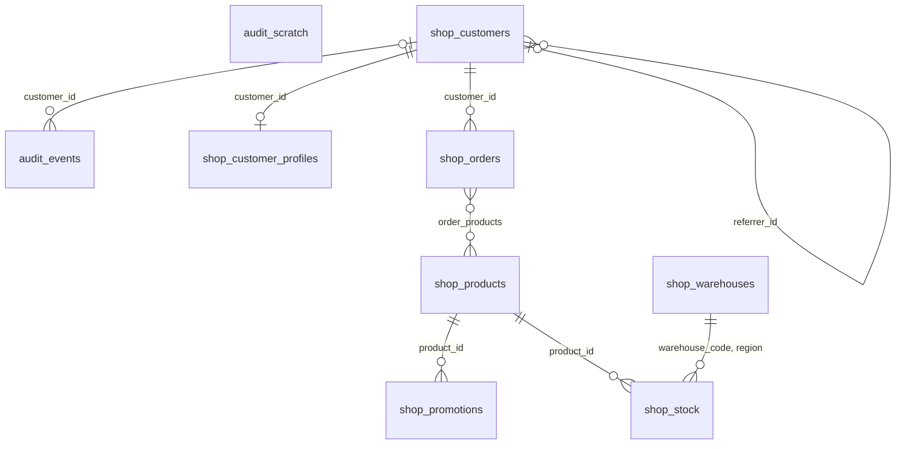
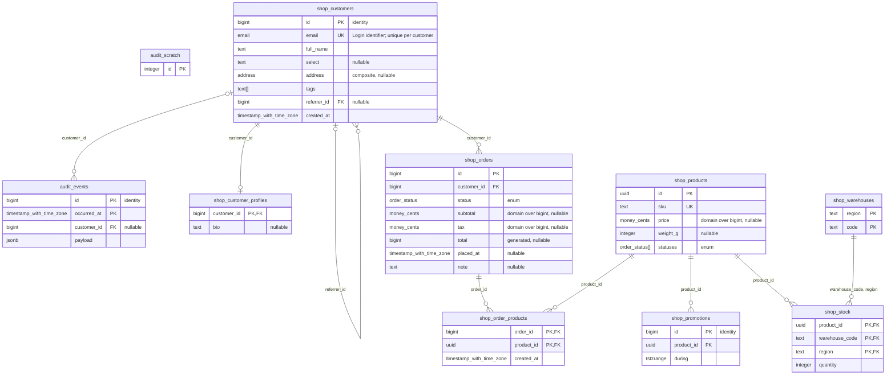

# Examples

Every file under `examples/*/out/` is generated by remus from the `schema.sql` next to
it, with `just examples`. Nothing here is hand-edited. Two schemas:

- **[blog](blog/schema.sql)**: six tables, an enum, a self-referencing FK, a junction
  table and a view. Small enough to read in one screen.
- **[showcase](showcase/schema.sql)**: the fixture behind the test suite. Two schemas,
  domains, a composite type, arrays, a partitioned table, generated and identity
  columns, a composite foreign key, an exclusion constraint, row level security,
  views over views and a materialized view.

The diagrams below are the Mermaid output rendered by GitHub itself.

## Blog

```bash
remus --url postgres://localhost/blog                 # Mermaid, physical
remus --url postgres://localhost/blog --conceptual    # junction tables collapsed
remus --url postgres://localhost/blog --views         # views and what they read
remus --url postgres://localhost/blog -f all --out-dir out
```

### Physical diagram

Output of the default run, [`out/schema.mmd`](blog/out/schema.mmd). Key markers come
from the constraints; the quoted note carries what a generic ERD drops (enum, identity,
nullable, or the column comment when there is one). Cardinalities are what the catalog
proves: `users |o--o{ comments` because `author_id` is nullable, `users ||--o|
profiles` because the FK column is also the primary key.



### Conceptual diagram

`--conceptual`, [`out/schema.conceptual.mmd`](blog/out/schema.conceptual.mmd).
`post_tags` has exactly two foreign keys and nothing else, so it disappears and becomes
one many-to-many edge named after it.



### With views

`--views`, [`out/schema.views.mmd`](blog/out/schema.views.mmd). Dashed edges point
from the relations a view reads to the view.



### DBML

[`out/schema.dbml`](blog/out/schema.dbml), ready to paste into dbdiagram.io, DrawSQL
or ChartDB. The enum becomes an `Enum` block that the editor links to the column.
Indexes keep their expressions; partial predicates and check constraints ride along as
notes, since DBML has no place for them.

<details>
<summary>Full DBML output</summary>

```text
Enum "public"."post_status" {
  "draft"
  "published"
  "archived"
}

Table "public"."comments" {
  "id" bigint [pk, not null, increment]
  "post_id" bigint [not null]
  "author_id" bigint
  "parent_id" bigint
  "body" text [not null]
  "posted_at" "timestamp with time zone" [not null, default: `now()`]
}

Table "public"."post_tags" {
  "post_id" bigint [not null]
  "tag_id" integer [not null]

  indexes {
    ("post_id", "tag_id") [pk]
  }
}

Table "public"."posts" {
  "id" bigint [pk, not null, increment]
  "author_id" bigint [not null]
  "title" text [not null]
  "slug" text [not null, unique, note: 'URL fragment, unique per site']
  "body" text [not null]
  "status" "public"."post_status" [not null, default: 'draft']
  "published_at" "timestamp with time zone"

  indexes {
    ("author_id") [name: 'posts_author_idx']
    (`published_at DESC`) [name: 'posts_published_idx', note: 'where status = \'published\'::public.post_status']
  }

  Note: 'posts_published_have_a_date: CHECK (((status <> \'published\'::public.post_status) OR (published_at IS NOT NULL)))'
}

Table "public"."profiles" {
  "user_id" bigint [pk, not null]
  "bio" text
  "website" text
}

Table "public"."tags" {
  "id" integer [pk, not null, increment]
  "name" text [not null, unique]
}

Table "public"."users" {
  "id" bigint [pk, not null, increment]
  "email" text [not null, unique]
  "name" text [not null]
  "created_at" "timestamp with time zone" [not null, default: `now()`]

  Note: 'Anyone who can log in'
}

Ref "comments_author_id_fkey": "public"."comments"."author_id" > "public"."users"."id" [delete: set null]
Ref "comments_parent_id_fkey": "public"."comments"."parent_id" > "public"."comments"."id" [delete: cascade]
Ref "comments_post_id_fkey": "public"."comments"."post_id" > "public"."posts"."id" [delete: cascade]
Ref "post_tags_post_id_fkey": "public"."post_tags"."post_id" > "public"."posts"."id" [delete: cascade]
Ref "post_tags_tag_id_fkey": "public"."post_tags"."tag_id" > "public"."tags"."id" [delete: cascade]
Ref "posts_author_id_fkey": "public"."posts"."author_id" > "public"."users"."id"
Ref "profiles_user_id_fkey": "public"."profiles"."user_id" - "public"."users"."id" [delete: cascade]

// Views are not representable in DBML:
//   "public"."published_posts"
```

</details>

### SQL DDL

[`out/schema.sql`](blog/out/schema.sql). Foreign keys come as `ALTER TABLE` after
every table exists, views after the tables they read, comments last. The file replays
into an empty database as-is.

```sql
CREATE TYPE public.post_status AS ENUM ('draft', 'published', 'archived');

CREATE TABLE public.posts (
    id bigint GENERATED ALWAYS AS IDENTITY NOT NULL,
    author_id bigint NOT NULL,
    title text NOT NULL,
    slug text NOT NULL,
    body text NOT NULL,
    status public.post_status DEFAULT 'draft'::public.post_status NOT NULL,
    published_at timestamp with time zone,
    CONSTRAINT posts_published_have_a_date CHECK (((status <> 'published'::public.post_status) OR (published_at IS NOT NULL))),
    CONSTRAINT posts_pkey PRIMARY KEY (id),
    CONSTRAINT posts_slug_key UNIQUE (slug)
);

-- ... every other table ...

ALTER TABLE public.posts ADD CONSTRAINT posts_author_id_fkey FOREIGN KEY (author_id) REFERENCES public.users(id);
ALTER TABLE public.profiles ADD CONSTRAINT profiles_user_id_fkey FOREIGN KEY (user_id) REFERENCES public.users(id) ON DELETE CASCADE;

CREATE INDEX posts_published_idx ON public.posts USING btree (published_at DESC) WHERE (status = 'published'::public.post_status);

CREATE VIEW public.published_posts AS
SELECT p.id,
    p.title,
    p.slug,
    u.name AS author,
    p.published_at
   FROM public.posts p
     JOIN public.users u ON u.id = p.author_id
  WHERE p.status = 'published'::public.post_status;

COMMENT ON COLUMN public.posts.slug IS 'URL fragment, unique per site';
```

### JSON

[`out/schema.json`](blog/out/schema.json) is the model everything else is rendered
from, and the one format that loses nothing. Single-letter codes are PostgreSQL's own
(`kind: "r"` is a table, `type_kind: "b"` a base type, `on_delete: "c"` cascade).
One entity:

```json
{
  "schema": "public",
  "name": "profiles",
  "kind": "r",
  "comment": null,
  "rls": false,
  "rls_forced": false,
  "unlogged": false,
  "partition_key": null,
  "view_definition": null,
  "depends_on": [],
  "columns": [
    { "name": "user_id", "type": "bigint", "type_schema": "pg_catalog", "type_name": "int8",
      "type_kind": "b", "is_array": false, "not_null": true, "default": null,
      "identity": null, "generated": null, "comment": null },
    { "name": "bio", "type": "text", "...": "..." },
    { "name": "website", "type": "text", "...": "..." }
  ],
  "constraints": [
    { "name": "profiles_user_id_fkey", "kind": "f", "columns": ["user_id"],
      "ref_schema": "public", "ref_table": "users", "ref_columns": ["id"],
      "on_update": "a", "on_delete": "c", "deferrable": false,
      "definition": "FOREIGN KEY (user_id) REFERENCES public.users(id) ON DELETE CASCADE",
      "comment": null },
    { "name": "profiles_pkey", "kind": "p", "columns": ["user_id"],
      "definition": "PRIMARY KEY (user_id)", "...": "..." }
  ],
  "indexes": [],
  "policies": []
}
```

## Showcase

Two schemas, so diagram nodes are qualified (`shop_orders`). Everything the fidelity
table in the [README](../README.md#formats-and-fidelity) mentions appears somewhere
in these outputs.

### Overview

`--conceptual --no-attributes`, [`out/schema.boxes.mmd`](showcase/out/schema.boxes.mmd):
the shape of the schema with no columns, `order_products` collapsed into an N:N.
Partitions of `audit.events` are one box, not one per range.



### Physical diagram

[`out/schema.mmd`](showcase/out/schema.mmd). Domains show their base type,
composite and array columns keep their type name, the generated column and the
identity columns are marked.

<details>
<summary>Rendered diagram</summary>



</details>

### The rest

- [`out/schema.sql`](showcase/out/schema.sql): partitioned table and its partitions,
  `GENERATED ALWAYS AS (...) STORED`, a bare sequence for the `bigserial`, the
  exclusion constraint, the restrictive RLS policy, materialized view `WITH NO DATA`.
- [`out/schema.dbml`](showcase/out/schema.dbml): `TableGroup` per schema, the composite
  foreign key as `("warehouse_code", "region") > ("code", "region")`, one-to-one as `-`.
- With `--conceptual`, DBML writes the collapsed junction as a `<>` many-to-many ref.
- [`out/schema.json`](showcase/out/schema.json): the full model, including the
  `partitions`, `domains`, `composites` and `extensions` arrays.
